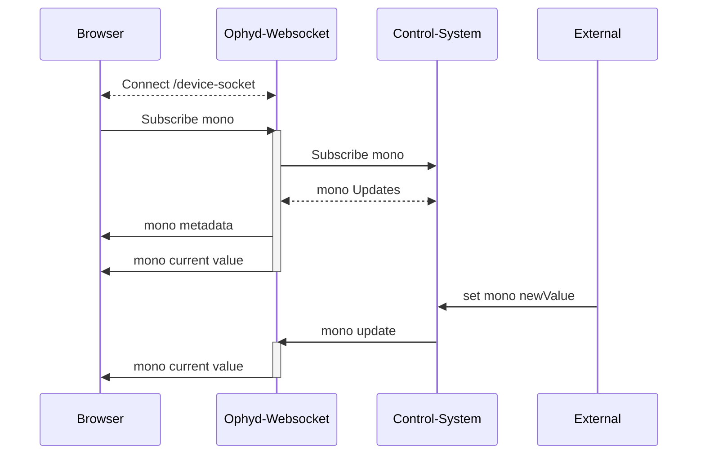
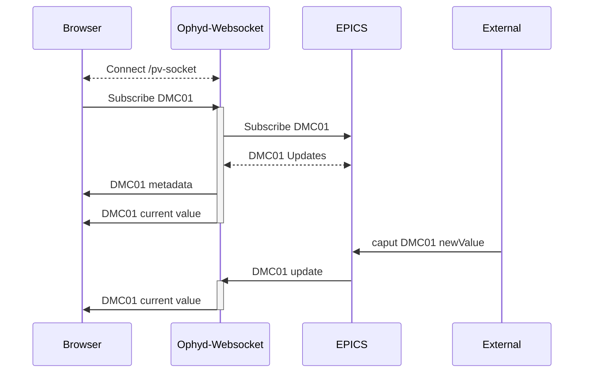

# ophyd-websocket
Experimental python based websocket server used to live-monitor and set ophyd device values through a web browser. Use branch feature/oas for the most recent updates.

## Use Case 
If you are building a web browser application and need to:
* Monitor the current value of an Ophyd device
* Set the value of a device
* Know immediately when a device disconnects/reconnects 

then ophyd-websocket can provide these features.

## How it works

Clients first instantiate a connection to the desired websocket path, then send a message through the websocket with the name of a device. The python server running the websocket uses Ophyd to subscribe callbacks to that device, which then trigger messages back to the client whenever the status of the device changes. This includes the device connecting/reconnecting and changes in value. Through the same websocket, a client may also send a message to change the value of the device.

Ophyd async is not currently supported.

A single websocket instance can hold any number of device subscriptions.


# Installation
```bash 
git clone https://github.com/bluesky/ophyd-websocket.git 
```
Optionally set up a conda environment
```bash
conda create -n ophyd_websocket python=3.12
conda activate ophyd_websocket
```
Install requirements

```bash
#/ophyd-websocket
pip install -r requirements.txt
```

# Starting the Websocket

Start the websocket server
```bash
#/ophyd-websocket
python server/server.py
```

Start the websocket server with host and port set in command line
```bash
#/ophyd-websocket
OAS_PORT=8001 OAS_HOST=0.0.0.0 python server/server.py
```

# Using device-socket for Ophyd devices
## Startup Directory
Any use of the device-socket path will require the server to start with a startup directory, followed by a POST request to instantiate the device registry.
```bash
python server/server.py --startup-dir /path/to/devices.py
```

```python
#devices.py

from ophyd import EpicsSignal
mono = EpicsSignal("bl531_xps1:mono_angle_deg", name="mono") #any ophyd device will be recognized and added to the device registry
```

Then make a POST request to /api/v1/load-devices which will load up the --startup-dir file(s).

```bash
curl -X 'POST' \
  'http://localhost:8001/api/v1/load-devices' \
  -H 'accept: application/json' \
  -d ''
```

## Example - Subscribing to a device
Example JSON message to ws://localhost:8001/api/v1/device-socket
```bash
#JSON Message from client to /api/v1/pv-socket
{
    "action": "subscribe",
    "device": "mono"
}
```

Responses from server over websocket:
```bash
#JSON Messages from /api/v1/device-socket to client

#first message indicates status of subscription attempt
{
    "message": "Subscribed to mono"
}
#second message is the current value (sent every time value changes)
{
    "device": "mono",
    "value": 0.0,
    "timestamp": 1759256744.247916,
    "connected": true,
    "read_access": true,
    "write_access": true
}
#optional third message is the connection information (only sent on connect/disconnect for certain Ophyd devices)
{
    "connected": true,
    "read_access": true,
    "write_access": true,
    "timestamp": 1759256744.247916,
    "status": 0,
    "severity": 0,
    "precision": 5,
    "setpoint_timestamp": null,
    "setpoint_status": null,
    "setpoint_severity": null,
    "lower_ctrl_limit": -100.0,
    "upper_ctrl_limit": 100.0,
    "units": "degrees",
    "enum_strs": null,
    "setpoint_precision": null,
    "sub_type": "meta",
    "obj": "IOC:m1",
    "device": "IOC:m1"
}
```

JSON message client to /api/v1/device-socket
```bash
#JSON Message from client to /api/v1/device-socket
{
    "action": "set",
    "device": "mono",
    "value": 10
}
```
Responses from server over websocket:

```bash
#JSON Message from /api/v1/device-socket to client
{
    "device": "mono",
    "value": 10,
    "timestamp": 1759259117.565635,
    "connected": true,
    "read_access": true,
    "write_access": true
}
```

# Messages and Responses


# Using pv-socket for EPICS pvs
In addition to subscribing to pre-instantiated ophyd devices, another path (/pv-socket) allows a client to send a message that is used to dynamically instantiate an ophyd device and add callbacks. This particular path only works for EPICS devices, but the same general strategy can be implemented for any other control system or ophyd class. The /pv-socket path accepts an EPICS PV and uses EpicsSignal to create an ophyd device. When using this method, it is recommended to always subscribe to the EPICS readback value for any PV that is meant to show live updates.

## Example - Subscribing to a pv
Example JSON message to ws://localhost:8000/api/v1/pv-socket
```bash
#JSON Message from client to /api/v1/pv-socket
{
    "action": "subscribe",
    "pv": "IOC:m1"
}
```

Responses from server over websocket:
```bash
#JSON Messages from /api/v1/pv-socket to client

#first message indicates status of subscription attempt
{
    "message": "Subscribed to IOC:m1"
}
#second message is the current value (sent every time value changes)
{
    "pv": "IOC:m1",
    "value": 0.0,
    "timestamp": 1759256744.247916,
    "connected": true,
    "read_access": true,
    "write_access": true
}
#third message is the connection information (only sent on connect/disconnect)
{
    "connected": true,
    "read_access": true,
    "write_access": true,
    "timestamp": 1759256744.247916,
    "status": 0,
    "severity": 0,
    "precision": 5,
    "setpoint_timestamp": null,
    "setpoint_status": null,
    "setpoint_severity": null,
    "lower_ctrl_limit": -100.0,
    "upper_ctrl_limit": 100.0,
    "units": "degrees",
    "enum_strs": null,
    "setpoint_precision": null,
    "sub_type": "meta",
    "obj": "IOC:m1",
    "pv": "IOC:m1"
}
```

JSON message client to /api/v1/pv-socket
```bash
#JSON Message from client to /api/v1/pv-socket
{
    "action": "set",
    "pv": "IOC:m1",
    "value": 10
}
```
Responses from server over websocket:

```bash
#JSON Message from /api/v1/pv-socket to client
{
    "pv": "IOC:m1",
    "value": 10,
    "timestamp": 1759259117.565635,
    "connected": true,
    "read_access": true,
    "write_access": true
}
```

# Messages and Responses


# Experimental Features
In addition to subscribing to PVs, where you must provide the exact PV name, you can also subscribe to devices, stream area detector images, and stream queue server console output from this server. These features are experimental.

## "Ophyd as a Service" REST API
After starting the server navigate to [http://localhost:8001/docs](http://localhost:8001/docs) to see endpoints and try out functionality. 

You can load up predefined Ophyd devices with a POST request to `http://localhost:8001/api/v1/load-devices`.

These predefined Ophyd devices should live in any python file that can be accessed during server startup. Pass a `--startup-dir` arg to the server with your file or folder.


## Stream Queue Server Console Output
Socket Endpoint: /api/v1/qs-console-socket

## Stream Area Detector Images
Socket Endpoint: /api/v1/camera-socket

# Docker setup
```bash
docker build -t ophyd-websocket . 
docker run -p 8001:8001 ophyd-websocket
```
