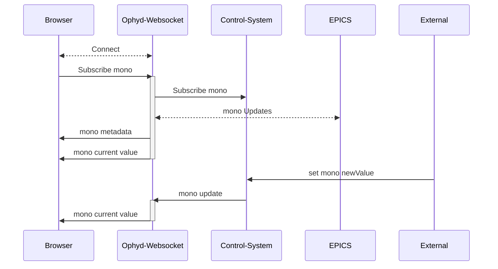

# ophyd-websocket
Experimental python based websocket server used to live-monitor and set ophyd device values through a web browser. Please use branch feature/oas for the most recent updates.

## Use Case 
If you are building a web browser application and need to:
* Monitor the current value of an Ophyd device
* Set the value of a device
* Know immediately when a device disconnects/reconnects 

then ophyd-websocket can provide these features.

## How it works

Clients first instantiate a connection to the desired websocket path, then send a message through the websocket with the name of a device. The python server running the websocket uses Ophyd to subscribe callbacks to that device, which then trigger messages back to the client whenever the status of the device changes. This includes the device connecting/reconnecting and changes in value. Through the same websocket, a client may also send a message to change the value of the device.

Ophyd async is not currently supported.

A single websocket instance can hold any number of device subscriptions.


# Installation
```bash 
git clone https://github.com/bluesky/ophyd-websocket.git 
```
Optionally set up a conda environment
```bash
conda create -n ophyd_websocket python=3.12
conda activate ophyd_websocket
```
Install requirements

```bash
#/ophyd-websocket
pip install -r requirements.txt
```

# Starting the Websocket

Start the websocket server
```bash
#/ophyd-websocket
python server/server.py
```

Start the websocket server with host and port set in command line
```bash
#/ophyd-websocket
OAS_PORT=8001 OAS_HOST=0.0.0.0 python server/server.py
```

# Using device-socket for Ophyd devices
## Startup Directory
Any use of the device-socket path will require the server to start with a startup directory, followed by a POST request to instantiate the device registry.
```bash
python server/server.py --startup-dir /path/to/devices.py
```

Then make a POST request to /api/v1/load-devices which will load up the --startup-dir file(s).

```bash
curl -X 'POST' \
  'http://localhost:8001/api/v1/load-devices' \
  -H 'accept: application/json' \
  -d ''
```

## Example - Subscribing to a device
Example JSON message to ws://localhost:8001/api/v1/device-socket
```bash
#JSON Message from client to /api/v1/pv-socket
{
    "action": "subscribe",
    "device": "mono"
}
```

Responses from server over websocket:
```bash
#JSON Messages from /api/v1/device-socket to client

#first message indicates status of subscription attempt
{
    "message": "Subscribed to mono"
}
#second message is the current value (sent every time value changes)
{
    "device": "mono",
    "value": 0.0,
    "timestamp": 1759256744.247916,
    "connected": true,
    "read_access": true,
    "write_access": true
}
#optional third message is the connection information (only sent on connect/disconnect for certain Ophyd devices)
{
    "connected": true,
    "read_access": true,
    "write_access": true,
    "timestamp": 1759256744.247916,
    "status": 0,
    "severity": 0,
    "precision": 5,
    "setpoint_timestamp": null,
    "setpoint_status": null,
    "setpoint_severity": null,
    "lower_ctrl_limit": -100.0,
    "upper_ctrl_limit": 100.0,
    "units": "degrees",
    "enum_strs": null,
    "setpoint_precision": null,
    "sub_type": "meta",
    "obj": "IOC:m1",
    "device": "IOC:m1"
}
```

JSON message client to /api/v1/pv-socket
```bash
#JSON Message from client to /api/v1/device-socket
{
    "action": "set",
    "device": "mono",
    "value": 10
}
```
Responses from server over websocket:

```bash
#JSON Message from /api/v1/device-socket to client
{
    "device": "mono",
    "value": 10,
    "timestamp": 1759259117.565635,
    "connected": true,
    "read_access": true,
    "write_access": true
}
```

# Messages and Responses


# WebSocket Endpoints

## device-socket vs pv-socket

The server provides two different WebSocket endpoints for monitoring and controlling devices:

- **`/api/v1/device-socket`** - For Ophyd devices from the device registry
- **`/api/v1/pv-socket`** - For direct EPICS PV connections

### Key Differences:

| Feature | device-socket | pv-socket |
|---------|---------------|-----------|
| **Data Source** | Device registry (requires startup files) | Direct EPICS PV connections |
| **Configuration** | Requires `--startup-dir` or device loading | No configuration needed |
| **Device Types** | Complex Ophyd devices (EpicsMotor, custom devices) | Individual EPICS PVs |
| **Message Format** | `{"device": "motor1"}` | `{"pv": "IOC:m1"}` |
| **Metadata** | Full device info including components | Basic PV metadata |
| **Connection Handling** | Aggregated connection state for multi-signal devices | Individual PV connection state |

## Using device-socket for Ophyd Devices

The `/api/v1/device-socket` endpoint works with devices loaded into the device registry from startup files. It supports complex Ophyd devices like EpicsMotor, custom Device classes, and PseudoPositioners.

### Available Actions

#### subscribe
Subscribe to real-time updates from a device in the registry.
```json
{
    "action": "subscribe",
    "device": "motor1"
}
```

#### subscribeSafely
Subscribe only if the device can be successfully connected to.
```json
{
    "action": "subscribeSafely", 
    "device": "motor1"
}
```

#### unsubscribe
Stop receiving updates from a device.
```json
{
    "action": "unsubscribe",
    "device": "motor1"
}
```

#### set
Set a value on a device.
```json
{
    "action": "set",
    "device": "motor1",
    "value": 5.0,
    "timeout": 2.0
}
```

#### refresh
Trigger a read of all subscribed devices.
```json
{
    "action": "refresh"
}
```

### Response Format
Device-socket responses include information about the specific signal within multi-component devices:
```json
{
    "device": "motor1",
    "signal": "motor1_user_readback",
    "value": 5.0,
    "timestamp": 1759256744.247916,
    "connected": true,
    "read_access": true,
    "write_access": true
}
```

## Using pv-socket for EPICS PVs

The `/api/v1/pv-socket` endpoint can be used for subscribing to individual EPICS PVs through Ophyd. This method does not require any configuration files or startup directory.

### Available Actions

#### subscribe
Subscribe to any EPICS PV (creates connection if it doesn't exist).
```json
{
    "action": "subscribe",
    "pv": "IOC:m1"
}
```

#### subscribeSafely
Subscribe only if the PV can be successfully connected to.
```json
{
    "action": "subscribeSafely",
    "pv": "IOC:m1"
}
```

#### subscribeReadOnly
Subscribe to a PV in read-only mode.
```json
{
    "action": "subscribeReadOnly",
    "pv": "IOC:m1"
}
```

#### unsubscribe
Stop receiving updates from a PV.
```json
{
    "action": "unsubscribe", 
    "pv": "IOC:m1"
}
```

#### set
Set a value on a PV (includes limit checking).
```json
{
    "action": "set",
    "pv": "IOC:m1",
    "value": 5.0,
    "timeout": 2.0
}
```

#### refresh
Trigger a read of all subscribed PVs.
```json
{
    "action": "refresh"
}
```

### Response Format
PV-socket responses focus on individual PV information:
```json
{
    "pv": "IOC:m1",
    "value": 0.0,
    "timestamp": 1759256744.247916,
    "connected": true,
    "read_access": true,
    "write_access": true
}
```

## Action Comparison

| Action | device-socket | pv-socket | Key Differences |
|--------|---------------|-----------|-----------------|
| **subscribe** | ✅ Subscribe to device from registry | ✅ Subscribe to any EPICS PV | Device-socket requires device to exist in registry; pv-socket creates connection on-demand |
| **subscribeSafely** | ✅ Subscribe with connection validation | ✅ Subscribe with connection validation | Both validate connection, but device-socket checks registry first |
| **subscribeReadOnly** | ❌ Not available | ✅ Read-only subscription | Only pv-socket supports explicit read-only mode (currently) |
| **unsubscribe** | ✅ Stop device updates | ✅ Stop PV updates | Same functionality, different parameter names |
| **set** | ✅ Set device value | ✅ Set PV value | Device-socket may target complex devices; pv-socket targets individual PVs |
| **refresh** | ✅ Refresh all subscribed devices | ✅ Refresh all subscribed PVs | Device-socket may refresh multiple signals per device |

### When to Use Each Endpoint

**Use `/api/v1/device-socket` when:**
- Working with complex Ophyd devices (EpicsMotor, custom Device classes)
- You have startup files defining your device configuration
- You need coordinated control of multi-component devices
- You want centralized device management through the registry

**Use `/api/v1/pv-socket` when:**
- Working with individual EPICS PVs
- You don't have device configuration files
- You need quick access to any PV without setup


# Messages and Responses


# Experimental Features
In addition to subscribing to PVs, where you must provide the exact PV name, you can also subscribe to devices, stream area detector images, and stream queue server console output from this server. These features are experimental and not intended for to be stable.

## "Ophyd as a Service" REST API
After starting the server navigate to [http://localhost:8001/docs](http://localhost:8001/docs) to see endpoints and try out functionality. 

### Configuration Parameters

The server can be configured using environment variables or command line arguments:

#### OAS (Ophyd as a Service) Configuration

| Parameter | Environment Variable | Default | Description |
|-----------|---------------------|---------|-------------|
| Host | `OAS_HOST` | `localhost` | Server host address |
| Port | `OAS_PORT` | `8001` | Server port number |
| Startup Directory | `OAS_STARTUP_DIR` | None | Path to directory containing device definition files |
| Require Queue Server | `OAS_REQUIRE_QSERVER` | `true` | Whether queue server safety checks are enforced |
| Allowed Origins | `OAS_ALLOWED_ORIGINS` | None | Additional CORS origins (comma-separated) |

#### Queue Server Configuration
The REST API endpoints for setting values of devices can optionally first check if the Queue Server is active and reject requests if a plan is running. This feature is currently only available on the REST endpoints, not the websockets, but is planned to be added to websockets.
| Parameter | Environment Variable | Default | Description |
|-----------|---------------------|---------|-------------|
| Host | `QSERVER_HTTP_SERVER_HOST` | `localhost` | Queue server HTTP API host |
| Port | `QSERVER_HTTP_SERVER_PORT` | `60610` | Queue server HTTP API port |
| API Key | `QSERVER_HTTP_SERVER_SINGLE_USER_API_KEY` | `test` | Authentication key for queue server |

#### EPICS Configuration
If you are using EPICS as the underlying controls system, ensure that you have proper environment variables set.
| Parameter | Environment Variable | Description |
|-----------|---------------------|-------------|
| Address List | `EPICS_CA_ADDR_LIST` | Space-separated list of EPICS CA gateway addresses |
| Auto Address List | `EPICS_CA_AUTO_ADDR_LIST` | Enable/disable automatic address list discovery |
| Max Array Bytes | `EPICS_CA_MAX_ARRAY_BYTES` | Maximum size for EPICS array transfers |

#### Example Usage

```bash
# Using environment variables
export OAS_HOST=0.0.0.0
export OAS_PORT=8001
export OAS_STARTUP_DIR=/path/to/devices
export QSERVER_HTTP_SERVER_HOST=queue-server.local
python server/server.py

# Using command line arguments
python server/server.py --startup-dir /path/to/devices.py

# Using both (environment variables take precedence)
OAS_PORT=8002 python server/server.py --startup-dir /path/to/devices
```

### Device Loading

You can load up predefined Ophyd devices with a POST request to `http://localhost:8001/api/v1/load-devices`.

These predefined Ophyd devices should live in any python file that can be accessed during server startup. Pass a `--startup-dir` arg to the server with your file or folder.

```bash
python server/server.py --startup-dir /path/to/devices.py
```
Then in your python file instantiate your Ophyd devices, which will then be available when making API calls or websocket subscriptions to devices.

```python
#/path/to/devices.py
from ophyd import EpicsSignal, EpicsMotor, Device, Component

# Simple EPICS signals - these will be detected and added to registry
sim_motor1 = EpicsSignal("IOC:m1", name="motor1")
sim_motor2 = EpicsMotor("IOC:m2", name="motor2")
# Custom Ophyd Device class
class SimpleMotor(Device):
    """A simple motor device with position and velocity"""
    m1 = Component(EpicsSignal, "m1")
    m2 = Component(EpicsSignal, "m2")

sim_motor_device = SimpleMotor("IOC:", name="sim_motor_device")
```


## Stream Queue Server Console Output
Socket Endpoint: /api/v1/qs-console-socket

## Stream Area Detector Images
Socket Endpoint: /api/v1/camera-socket

# Docker setup
```bash
docker build -t ophyd-websocket . 
docker run -p 8001:8001 ophyd-websocket
```